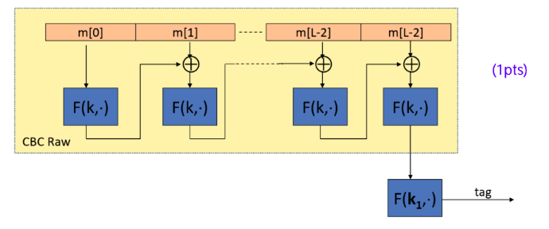
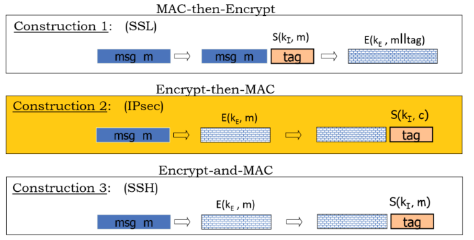
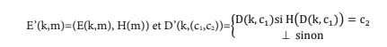
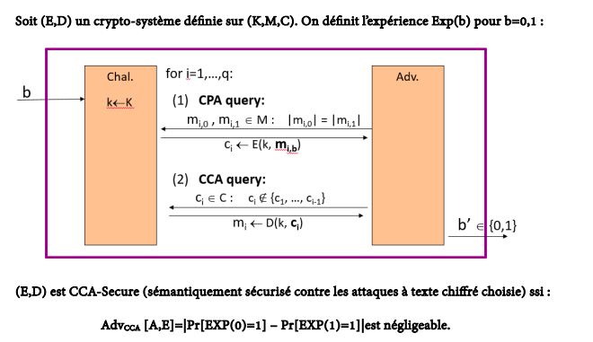
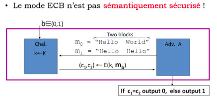
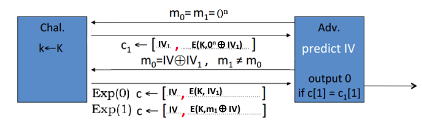
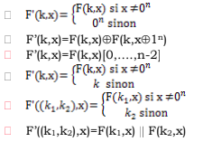
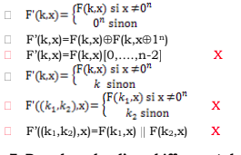

# **NOTE:** These are questions and answers from various cryptography exams. Take a look, they might help! If you see anything wrong, please let me know so I can correct it. Finally, ad3oulna m3akom! 🙏 

# > **Also, a big shoutout to the legendary** Mamoun Bilal **who shared the exams!** 🌟 

# Questions de Cours - Cryptographie

## Question 1
**Quelle est la différence entre un chiffrement aléatoire et un chiffrement par nonce ? Dans quel cas chacun des deux modes est utilisé ?**

Voir la réponse

Dans un chiffrement aléatoire, un vecteur d'initialisation (IV) est utiliser avec un mode opératoire pour assurer que le même message chiffré deux fois avec la même clé no donne pas le même résultat. Un chiffrement par nonce suit le même principe sauf que le nonce est un compteur qui s'incrémente automatiquement pour chaque nouveau message. Le chiffrement aléatoire est préférable pour les communications asynchrone alors que le chiffrement par nonce est préférable pour les communications synchrones.

---

## Question 2
**Comment un MAC peut-il être construit en utilisant une PRF pour des messages de taille fixe et arbitraire ?**

Voir la réponse

Soit « F » une PRF sémantiquement sécurisé. Un MAC peut être construit pour des messages de taille fixe (sur un seul bloc) de la manière suivante :
- S(k,m) = F(k,m) = t
- V(k,m,t) = {si F(k,m)= t alors « vrais » sinon « Faux »}

Pour des messages de tailles arbitraires (sur plusieurs blocs), ce MAC peut être étendu en utilisant l'un des modes opératoires des MAC : ECBC-MAC, NMAC, PMAC ... A titre d'exemple, le mode ECBC-MAC peut être utilisé comme suit :

---

## Question 3
**Expliquez le principe du chiffrement ONE-TIME-PAD et comment récupérer la clé.**

Voir la réponse

Le chiffrement en utilisant le ONE-TIME-PAD consiste en la combinaison du message en claires M avec une clé K de même tailles en bits : C = M Å K. La clé ne doit être utilisée qu'une seul fois sinon la sécurité n'est pas assurée. Puisque l'algorithme utilisé est le One-Time-Pad, le chiffrement se fait par un xor entre le texte en claire et la clé. Un xor entre le texte chiffré et le texte en claire nous donnera la clé utilisé K.

---

## Question 4
**Quelles sont les trois constructions standards de l'Authenticated Encryption (AE) ?**

Voir la réponse

---

## Question 5
**Citez avec description les quatre niveaux d'attaques sur un crypto-système.**

Voir la réponse

- **Attaque à texte chiffré seulement** : l'attaquant à accès aux messages chiffrées seulement et cherche à trouver des informations sur le message en claire.

- **Attaque à texte claire connue** : l'attaquant connait une partie du message en claire et combine cette information avec le message en claire pour reconstruire une partie inconnue du message en claire.

- **Attaque à textes claires choisie** : l'attaquant a le pouvoir de soumettre plusieurs messages en claire de son choix et d'obtenir leurs versions chiffrées et avec cela il veut cassez la sécurité sémantique du crypto-système.

- **Attaque à textes chiffrées choisies** : l'attaquant a le pouvoir d'obtenir la version chiffrée de messages claires de son choix, et avec cela il veut cassez la sécurité sémantique du crypto-système.

---

## Question 6
**La définition de la sécurité sémantique dans le scénario One-Time-Key (OTK), n'est plus suffisante dans le scénario Many-Times-Key (MTK). Expliquez pourquoi, et quelle est la solution ?**

Voir la réponse

Dans le cas du scénario MTK, la même clé est utilisée pour chiffrée plusieurs messages différents, ceci permet à un attaquant de toujours gagner le jeu de la sécurité sémantique dans sa définition standard (OTK) : il peut toujours faire la différence entre le chiffrement d'un message m0 et celui d'un message différent m1 avec une probabilité significative si la même clé est utilisée.

La solution dans le scénario MTK est d'utiliser le chiffrement probabiliste (Randomized Encryption) soit avec un IV ou Nonce en fonction du contexte d'utilisation.

---

## Question 7
**Expliquez le principe du chiffrement par flot, et pourquoi il ne peut être parfaitement sécurisé.**

Voir la réponse

Dans le cadre du chiffrement par flot, un PRNG (Pseudo-Random-Numbers-Generator) est utilisé pour générer une séquence aléatoires PRNG(K) de valeurs à partir de la clé comme condition initiale (Seed) ; ensuite cette séquence est combiner par un Xor avec le message en claire M pour obtenir le message chiffrée C = M (XOR) PRNG(K). L'ors du déchiffrement, la même séquence est générer à partir de la même clé, et le message en clair est reconstruit par M = C (XOR) PRNG(K). 

Ce mode de chiffrement est sécurisé si le PRNG est imprédictible, mais il ne peut avoir une sécurité parfaite car le nombre de clés est finie (Dépend de la taille de la clé K non pas de la taille du message en claire).

---

## Question 8
**Compléter la démonstration que le mode CBC avec un IV prédictible n'est pas CPA-sécurisé.**

Voir la réponse

---

## Question 9
**Soit (E,D) un crypto-système qui assure l'AE, et H une fonction de hachage sécurisée. On définit le crypto-système (E',D') comme suit, Est-il CPA-Sécurisé ? Préserve-t-il l'intégrité ? est-il CCA-sécurisé ?**

Voir la réponse

**CPA-Sécurité :** Ce crypto-système n'est pas CPA-Sécurisé. Un attaquant peut toujours faire la distinction entre le chiffrement de deux messages différents m₀ et m₁ : la fonction de hachage H étant sans clé, un adversaire peut soumettre m₀ et m₁ ensuite obtenir l'un des deux chiffrements Cᵇ = (Cᵇ₁, Cᵇ₂) = (E(k,mᵇ), H(mᵇ)). Il peut ensuite à son niveau calculer H(m₀) et H(m₁) et faire la comparaison avec Cᵇ₂ : Cᵇ₂ = m₀ implique Exp(0) sinon Exp(1).

**Intégrité :** Le crypto-système (E',D') protège l'intégrité : toute modification du message chiffré par un adversaire sera détecter l'ors du déchiffrement.

**CCA-Sécurité :** Le crypto-système (E',D') n'est pas CCA-Sécurisé car l'une des deux conditions nécessaires n'est pas vérifier : il devrait être CPA-Sécurisé et protège l'intégrité.

---

## Question 10
**Expliquez comment un MAC peut-il être construit en utilisant une PRF pour la protection d'un message sur un seul bloc. Que faut-il envisagé pour un message sur plusieurs blocs ?**

Voir la réponse

Si F est une PRF sémantiquement sécurisé, et 1/|Y| est négligeable (Y est suffisamment large), alors le MAC IF=(S,V) définie par :
- t=S(k,m)=F(k,m)
- V(k,m,t) = {« yes » si t=F(k,m); « no » sinon }

est sémantiquement sécurisé.

Pour un message sur plusieurs blocs, il faut envisagé l'utilisation d'un mode opératoire pour les MACs (ECBC-MAC, NMAC, HMAC, PMAC ...).

---

## Question 11
**On suppose un crypto système E, pour lequel il existe un adversaire A qui peut toujours trouver le bit de poids faible (LSB) du texte en claire à partir seulement du texte chiffré. Montrez que E n'est pas CPA-sémantiquement sécurisé.**

Voir la réponse

---

## Question 12
**Quel est la différence entre un chiffrement aléatoire (probabiliste) et un chiffrement par « nonce » ? Dans quel cas chacun des deux modes est utilisé ?**

Voir la réponse

Dans le chiffrement aléatoire (probabiliste) le IV qui représente la valeur initialement utilisées pour le chaînage du chiffrement par le mode opératoire (CBC, CTR,...) est une valeur générée aléatoirement pour chaque chiffrement est transmise en parallèle avec le message chiffré. Par contre, dans le cadre du chiffrement par « nonce », cette valeur est tout simplement un compteur qui s'incrément pour chaque nouveau message chiffré, et elle n'est donc pas transmise puisqu'elle peut être calculer du côté du récepteur. 

Le mode par IV est utilisé dans le cas d'une communication asynchrone (IPSEC par exemple) alors que le mode par « nonce » est utilisé dans le cas d'une communication synchrone (« https »).

---

## Question 13
**Expliquez le principe de fonctionnement d'un chiffrement par flot ? Donner les conditions de sécurité ainsi que la définition de son jeu de sécurité sémantique.**

Voir la réponse

Dans le cadre d'un chiffrement par flot, un PRNG (générateur de nombres pseudo-aléatoires) est utilisé pour créer des séquences pseudo-aléatoires (keystream ou flot) à combiner avec le message en claire par un opérateur arithmétique (généralement un xor ou une addition modulo 256). Le déchiffrement se fait en combinant cette séquence avec le message chiffré pour reconstruire le message en claire de nouveau (du côté récepteur).

La sécurité du chiffrement par flot dépend exclusivement de la sécurité du PRNG utilisé, qui est considéré comme sécurisé s'il est imprédictible (i.e la connaissance d'une partie du key-Stream jusqu'à la position « i » ne permet pas de prédire la valeur à la position « i+1 » avec une probabilité supérieure à 1⁄2, pour toute position i).

---

## Question 14
**Quelle est la différence entre un MAC et une fonction de Hachage ? Pour la prévention de quel type d'attaques le premier est utilisé ?**

Voir la réponse

Un MAC utilise une clé secrète alors qu'une fonction de hachage ne le fait pas, donc un adversaire peut toujours calculer la valeur d'un hach, alors que la valeur du MAC ne peut être calculer qu'avec la clé secrète. Un MAC est utilisé pour se prévenir contre une attaque active.

---

## Question 15
**Expliquez le jeu de la sécurité sémantique dans le cadre de la CCA-sécurité.**

Voir la réponse

---

## Question 16
**Quelle est la différence entre le chiffrement symétrique et le chiffrement asymétrique ? Donnez des exemples.**

Voir la réponse

Dans le cas du chiffrement symétrique, la clé du déchiffrement est facilement calculable à partir de la clé de chiffrement (généralement c'est la même). Pour le chiffrement asymétrique deux clés différentes sont utilisées pour le chiffrement / déchiffrement : clé publique et clé privée avec la difficulté calculatoire (impossible pratiquement) de déduire l'une à partir de l'autre.

**Exemples :**
- Chiffrement symétrique : DES, AES, IDEA, HILL, ...
- Chiffrement Asymétrique : RSA, EL-GAMAL, ...

---

## Question 17
**Sur quoi repose la sécurité du RSA et de EL-Gamal ?**

Voir la réponse

La sécurité du RSA repose sur la difficulté de factoriser des grandes nombres en produit de facteurs premiers. La sécurité de EL-Gamal repose sur la difficulté de trouver le Logarithme discret dans un groupe cyclique.

---

## Question 18
**Quel est le problème de sécurité commun entre les algorithmes de chiffrement symétriques et quelle est la solution ?**

Voir la réponse

Le problème de sécurité commun entre les algorithmes de chiffrement symétriques est celui de l'échange de la clé secrète sur un canal non sécurisé. La solution est d'utiliser soit la cryptographie asymétrique (RSA, ELGAMAL, ...), soit un mécanisme d'échange de clés sécurisé (Diffie-Hellman).

---

## Question 19
**Quelle est la structure de base de conception du DES et quels sont ses avantages ?**

Voir la réponse

La structure de base de conception du DES est les réseaux de Feistel. L'un de ses avantages est de pouvoir utiliser la même structure pour le chiffrement et le déchiffrement. Un autre avantage est que la sécurité sémantique de cette structure est formellement prouvée pour plus de 3 tours.

---

## Question 20
**En cas d'erreur au niveau du bloc N° l/2, combien de blocs clairs seront corrompus après déchiffrement en utilisant le mode CBC et le mode OFB ?**

Voir la réponse

En utilisant le mode CBC deux blocs clairs seront corrompus après déchiffrement : le bloc N° l/2 et le suivant (voir le schéma du mode CBC). En utilisant le mode OFB, seulement le bloc N° l/2 sera corrompu (voir le schéma du mode OFB).

---

## Question 21
**Définissez la résistance aux collisions pour une fonction de hachage.**

Voir la réponse

Résistance aux collisions : l'attaquant ne doit pas être en mesure de trouver deux messages différents (x; x') tels que h(x) = h(x'), en moins de (2^(n/2)) opérations.

---

## Question 22
**Sur quoi repose la sécurité du RSA et quelle est sa vulnérabilité principale ? Quelle est la solution ?**

Voir la réponse

La sécurité du RSA repose sur la difficulté de factoriser des grands nombres entiers. Il est vulnérable à une attaque par dictionnaire car la clé de chiffrement est publique, donc un attaquant peut l'utiliser pour construire un dictionnaire de mots chiffrés / clairs. La solution est d'utiliser un schéma de padding avec une extension aléatoire soustraite lors du déchiffrement.

---

## Question 23
**Dans le système EL-Gamal, est-ce que la connaissance du nombre aléatoire K rend le système vulnérable ?**

Voir la réponse

Oui, la connaissance du nombre aléatoire K rend le système complètement vulnérable, car un attaquant qui intercepte C1=m.A^k [p] et C2=g^k [p] peut reconstruire le message en clair m sans connaissance de la clé privée « a » de la manière suivante : 
1. calcule A^k [p]
2. calcule (A^k)^(-1) [p]
3. calcule C1.(A^k)^(-1) [p] = m.(A^k).(A^k)^(-1) [p] = m

---

## Question 24
**Quelle est la faiblesse du mode opératoire de chiffrement ECB et comment la contourner ?**

Voir la réponse

La faiblesse du mode opératoire de chiffrement ECB est le fait que les blocs identiques (de même contenu) sont toujours chiffrés de la même manière. Ceci permettra à un attaquant de déduire des informations sur le message en clair (égalité des blocs) en observant seulement le message chiffré. Pour contourner ce problème, on peut utiliser le mode CBC ou bien le mode CTR.

---

## Question 25
**Quelle est la différence entre un chiffrement aléatoire et un chiffrement par « nonce » ? Dans quel contexte utiliser chacun ?**

Voir la réponse

Dans un chiffrement aléatoire, le mode de chiffrement est initialisé avec un vecteur aléatoire (IV) qui ne doit pas être prédictible et ne doit jamais être réutilisé. En plus, ce IV est transmis avec le message chiffré pour pouvoir faire le déchiffrement à la réception. Par contre, un « nonce » est tout simplement un compteur qui s'incrémente automatiquement avec chaque nouveau bloc à chiffrer, donc pas besoin de le transmettre.

Le chiffrement aléatoire est généralement utilisé dans le cas d'une communication asynchrone (https par exemple), alors que le chiffrement par « nonce » est utilisé dans le cas d'une communication synchrone (IpSec par exemple).

---

## Question 26
**Pourquoi un CRC ne peut-il pas être utilisé pour la protection des messages contre un attaquant actif ?**

Voir la réponse

Un CRC ne peut être utilisé pour la protection des messages contre un attaquant actif car son calcul ne nécessite aucune clé de chiffrement. Un attaquant peut tout simplement modifier le message et recalculer le CRC, ceci ne sera pas détecté lors du déchiffrement.

---

## Question 27
**Décrire une attaque sur la CPA-Security du CBC avec IV s'il est prédictible.**

Voir la réponse

---

## Question 28
**Quelle est la différence entre le chiffrement par flot et le chiffrement par bloc ?**

Voir la réponse

La différence entre le chiffrement par flot et le chiffrement par bloc se résume en deux points essentiels :

- **Sur le plan du mécanisme de chiffrement** : le chiffrement par flot considère le texte en clair comme un seul bloc de bits (ou d'octets) et le combine en xor avec un keystream généré par un PRNG sécurisé. C'est une adaptation du OTP. Tandis que le chiffrement par bloc divise le message en clair en blocs de taille identique et chiffre ces blocs chacun avec une PRP/PRF selon un mode opératoire défini.

- **Sur le plan de la sécurité** : la sécurité du chiffrement par flot dépend de la sécurité du PRNG utilisé alors que la sécurité du chiffrement par bloc dépend de la sécurité de la PRP utilisée ainsi que du mode opératoire.

---

## Question 29
**Quelle est la différence entre une attaque passive et une attaque active ? Quelle est la solution pour chacune ?**

Voir la réponse

Dans une attaque passive l'adversaire se contente d'observer ou de lire le message chiffré pour essayer de déduire des informations sur le message en clair ou la clé. Dans une attaque active, l'adversaire a la possibilité de modifier/supprimer des parties du message chiffré. La solution envisagée pour une attaque passive est l'utilisation d'algorithmes de chiffrement alors que la solution pour une attaque active est l'utilisation des MAC.

---

## Question 30
**Quelle est la différence entre une PRP et une PRF ? Comment définir leur sécurité ?**

Voir la réponse

La différence entre une PRP et une PRF est que la première doit être inversible alors que la deuxième est à sens unique (non inversible), une PRF est une fonction alors qu'une PRP est une permutation bijective. 

Une PRP/PRF est sécurisée si sa sortie ne peut être différenciée de celle d'une fonction aléatoire : aucun adversaire ne doit être capable de faire la distinction entre la sortie de la PRP/PRF obtenue avec une clé et un bloc de données, et la sortie d'une fonction aléatoire avec une probabilité qui n'est pas négligeable (>ε).

---

# QCM - Questions à Choix Multiples

## QCM 1
**Une authentification par CRC permet de protéger l'intégrité des données :**

- Contre un attaquant passif
- Contre les erreurs de transmission
- Les deux
- Aucun des deux

Voir la réponse

- ❌ Contre un attaquant passif
- ✅ **Contre les erreurs de transmission**
- ❌ Les deux
- ❌ Aucun des deux

---

## QCM 2
**Un chiffrement par flot assure une sécurité parfaite si :**

- Le PRNG utilisé est sécurisé
- La taille de la clé est au moins 128 bits
- La même clé n'est jamais utilisée
- Il n'assure jamais la sécurité parfaite

Voir la réponse

- ❌ Le PRNG utilisé est sécurisé
- ❌ La taille de la clé est au moins 128 bits
- ❌ La même clé n'est jamais utilisée
- ✅ **Il n'assure jamais la sécurité parfaite**

---

## QCM 3
**Pour que le mode de chiffrement CBC avec nonce soit CPA-Secure, le chiffrement du nonce :**

- N'est pas obligatoire
- Est obligatoire avec la clé k du chiffrement
- obligatoire avec une clé différente de celle du chiffrement
- Ce mode ne peut pas être CPA-Secure

Voir la réponse

- ❌ N'est pas obligatoire
- ❌ Est obligatoire avec la clé k du chiffrement
- ✅ **Est obligatoire avec une clé différente de celle du chiffrement**
- ❌ Ce mode ne peut pas être CPA-Secure

---

## QCM 4
**Si la même clé est toujours utilisée, le mode CBC :**

- Est sémantiquement sécurisé avec un IV imprédictible
- Est sémantiquement sécurisé quand le « nonce » est chiffré avec k1 ≠ k
- Est parfaitement sécurisé
- N'est pas sémantiquement sécurisé

Voir la réponse

- ✅ **Est sémantiquement sécurisé avec un IV imprédictible**
- ✅ **Est sémantiquement sécurisé quand le « nonce » est chiffré avec k1 ≠ k**
- ❌ Est parfaitement sécurisé
- ❌ N'est pas sémantiquement sécurisé

---

## QCM 5
**Sachant que F est une PRF sécurisée, citez parmi les PRFs suivants ceux qui sont sécurisés :**

Voir la réponse

**Question :**

**Réponse :**

---
